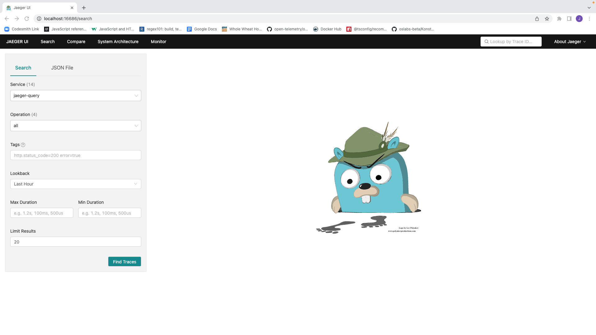
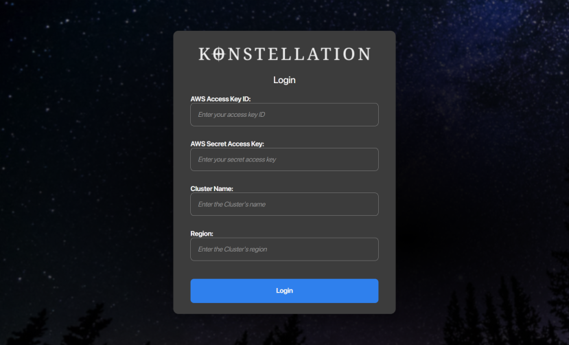
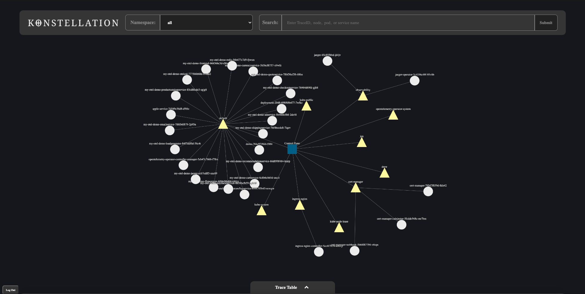
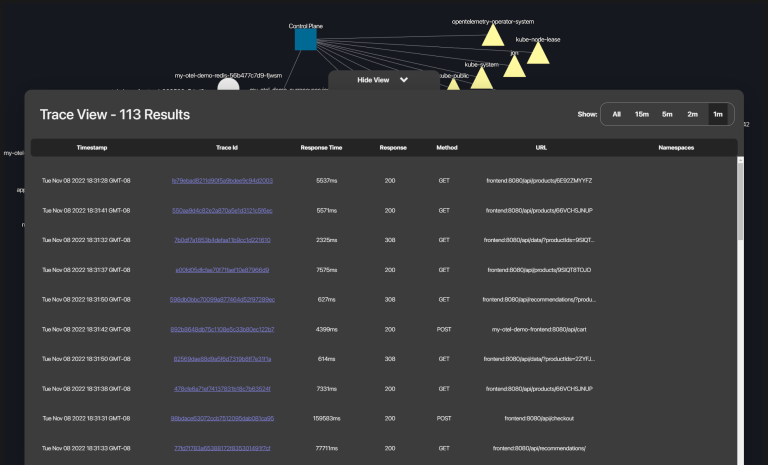
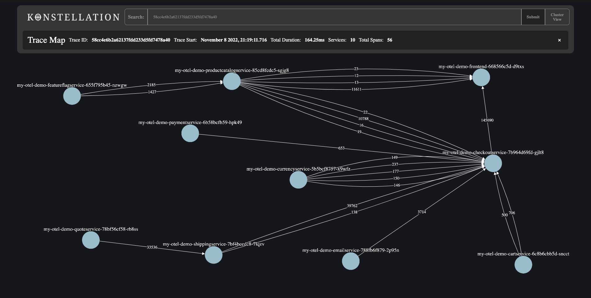
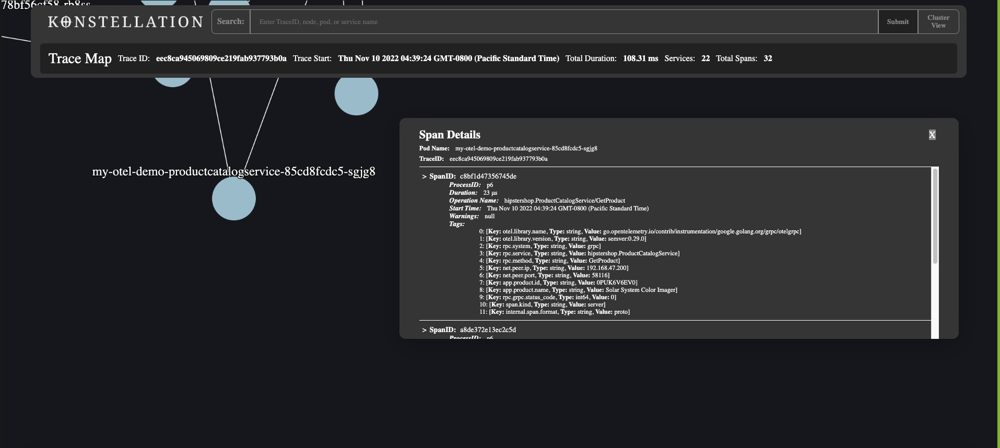

# 

# Summary
Konstellation is an Open Source Distributed Tracing tool built specifically for Kubernetes.

This tool gathers telemetry data within a kubernetes cluster and presents it within an intuitive Source Map topology, and provides developers with additional tools to identify and examine trace data in detail.

Please read the [website](http://konstellationapp.com/) and [medium](https://medium.com/@katalystyt0/kubernetes-clusters-visualization-with-konstellation-647d61aa817b) article for more information.

# Getting Started
Prerequisites:
- [ ] Kubectl Installed
- [ ] cert-manager installed
- [ ] Opentelemetry collector and operator deployed on the cluster
- [ ] Opentelemetry instrumentation integrated within your app
- [ ] Jaeger deployed on the cluster

Check out our [QuickStart](#quickstart) section for instructions on how to quickly setup the application.

*Note*
- If your App is not instrumented with Opentelemetry instrumentation, the following instructions will provide a method to instrument a NodeJS, Python, or Java app with Opentelemetry Autoinstrumentation. Do note that Opentelemtry is not yet compatible with [WhatWG standardized](https://fetch.spec.whatwg.org/) fetch requests introduced in NodeJS 17.5 (commonly called Node 18/native fetch), and so services using this feature will not correctly propagate.

- Custom deployment of the Opentelemetry Operator Collector, and the deployment of the Jaeger Operator and collector is possible. As long as the `Jaeger-frontend` is exposed on `localhost:16686`, Konstellation can be used.

- The app has been tested on both AWS Elastic Kubernetes Service as well as unmanaged clusters. While it is expected that this application will work with other managed Kubernetes providers, support on such platforms is not officially supported.

- ENV templates have been provided in the client.zip and server.zip files

# Installing Kubectl
- Instructions to install kubectl [here](https://kubernetes.io/docs/tasks/tools/)

## Install with Homebrew on macOS
If you are on macOS and using [Homebrew](http://brew.sh) package manager, you can install kubectl with Homebrew.
1. Run the installation command:

```
brew install kubectl
```

or

```
brew install kubernetes-cli
```

2. Test to ensure the version you installed is up-to-date:

```
kubectl version --client
```

# Installing cert-manager
- Detailed Instructions for installing `cert-manager` [here](https://cert-manager.io/docs/installation/)

To install cert-manager run:

```
kubectl apply -f https://github.com/cert-manager/cert-manager/releases/download/v1.10.0/cert-manager.yaml
```

# Deploying Opentelemetry Operator and Collector
- Detailed instructions for installing the Opentelemetry Operator and Collector can be found [here](https://github.com/open-telemetry/opentelemetry-operator)

When deploying the operator and collector services, please ensure that cert-manager has also been installed in your system. The Opentelemetry Operator and Collector may be deployed via helm chart or manually.

## (Optional) Deploy Via Helm chart
The Opentelemetry Operator can be deployed via [Helm Chart](https://github.com/open-telemetry/opentelemetry-helm-charts/tree/main/charts/opentelemetry-operator) from the opentelemetry-helm-charts repository. More information can be found [here](https://github.com/open-telemetry/opentelemetry-helm-charts/tree/main/charts/opentelemetry-operator).

## Install Opentelemetry Operator
Once cert-manager is installed, deploy the operator by applying the YAML cofiguration with the following command:

```bash
kubectl apply -f https://github.com/open-telemetry/opentelemetry-operator/releases/latest/download/opentelemetry-operator.yaml
```

Once the `opentelemetry-operator` deployment is succefully running, create an OpenTelemetry Collector (otelcol) instance:

A pre-configured OpenTelemetry collector YAML file is provided in the konstellation-yaml folder of this repository. With it available on your local system, run the following command: 

```
kubectl apply -f ./konstellation-yaml/setup/03-opentelemetry-collector.yaml
```

This will create an OpenTelemetry instance named `otel` which exposes a `jaeger-grpc` port to consume spans from your instrumented applications. This service will export those spans via `logging`, which writes the spans to the console (`stdout`) of the OpenTelemetry Collector instance that receives the span and to the `jaeger-collector`.

# (Optional) Setting up Opentelemetry Autoinstrumentation Injection
- Only required if your app does not have Opentelemetry's Autoinstrumentation built in. Do not set up Opentelemetry auoinstrumentation injection if your app is already instrumented with Opentelemetry SDK tools.

The operator can inject and configure OpenTelemetry auto-instrumentation libraries. Applications written in Java, NodeJS, Python, or using .NET Core/Framework are supported.

To use auto-instrumentation, configure an `Instrumentation` resource with the configuration for the SDK and instrumentation.

The requisite autoinstrumentation YAML file can again be found in the konstellation-yaml folder. To apply the instrumentation run:

```bash
kubectl apply -f ./konstellation-yaml/05-konstellation-autoinstrumentation.yaml
```

Next, an annotation must be added to enable pod injection. The annotation can be added to a namespace, so that all pods within that namespace will get instrumentation, or by adding the annotation to individual PodSpec objects, available as part of Deployment, Statefulset, and other resources.

Java:
```
instrumentation.opentelemetry.io/inject-java: "true"
```

NodeJS:
```
instrumentation.opentelemetry.io/inject-nodejs: "true"
```

Python:
```
instrumentation.opentelemetry.io/inject-python: "true"
```

.NET Core/Framework:
```
instrumentation.opentelemetry.io/inject-dotnet: "true"
```

For example, running the following command will patch the `default` namespace to allow Node-JS autoinstrumentation injection:

```
kubectl patch namespace default -p '{"metadata":{"annotations":{"instrumentation.opentelemetry.io/inject-nodejs": "true"}}}'
```

# Setting up Jaeger Operator and Collector
- Documentation to set up the Jaeger Operator on a Kubernetes cluster is available [here](https://www.jaegertracing.io/docs/1.39/operator/)

Before installing the Jaeger Operator, please ensure cert-manager is installed (it should be installed from earlier).

To install the Operator, run: 

```
kubectl create namespace observability # <1>
kubectl create -f https://github.com/jaegertracing/jaeger-operator/releases/download/v1.39.0/jaeger-operator.yaml -n observability # <2>

```
- The first command will create a namespace on your cluster named observability.
- The second command will create the jaeger operator in the observability namespace.

Once the Jaeger operator has been set up, we will need to create an instance of the jaeger collector on the cluster.

Create an instance of the Jaeger collector with the following command

``` 
kubectl apply -f ./konstellation-yaml/setup/04-jaegerconfig.yaml
```

# Port-Forwarding Jaeger

In order to retrieve trace data from these entities, the application requires access to the Jaeger Collector. To provide this access, port-forward the Jaeger Collector service to `localhost:16686`. This can be done with the following command:

```bash
kubectl port-forward jaeger-collector 16686:16686
```

With these services deployed, and the service now ported to the local machine, we can confirm functionality. Open a browser and navigate to  `http://localhost:16686`. The jaeger UI should load.



# Quickstart
The quickstart instructions will require that [`kubectl`](#installing-kubectl) is set up and [`cert-manager`](#installing-cert-manager) is installed. 

To begin, issue the following commands which will create and deploy the `Jaeger Operator` and `OpenTelemtry Operator` into the observability namespace:

```
kubectl apply -f ./konstellation-yaml/setup/runFirst.yaml 
```

Once the operator pods are deployed, run the following command:

```
kubectl apply -f ./konstellation-yaml/setup/runSecond.yaml
```

This second command will configure an `OpenTelemetry Collector` and `Jaeger Collector` in the default namespace. It will additionally set up autoinstrumentation for Node-JS applications in the default namespace and add an annotation to the namespace to allow the Operator to inject the autoinstrumentation to all pods residing in the namespace.

Once the Jaeger Collector has been set up, port-forward the jaeger collector to port 16686 with the following command:

```
kubectl port-forward services/jaeger-query 16686:16686
```

Confirm proper setup by visiting http://localhost:16686. You should see the JaegerUI.

# Running the Application

Once all of the prerequisite conditions are met, and Jaeger is port-forwarded to `localhost:16686`, run the following command:

```
npm install
```

Once all of the npm dependencies have resolved, run:

```
npm start
```

Navigate to `localhost:8080` to run the application

1. On successful startup, if you are not connected to your AWS cluster, please enter your AWS credentials, otherwise the app will proceed to the cluster map view.


2. To view a list of traces click on the table tabat the bottom of the screen.


3. To view a specific trace, click on the trace ID on the table.


4. To view span details, double-click on a pod in the trace map view.


5. To return to the clusterView click on the clusterView button.


5. To view a specific trace, if the trace Id is known, enter the traceId at the search bar on the top and click submit.

# Known Issues
- There is a known issue regarding apple silicon Macbooks causing incompatibility with the 'canvas' package. 
The issue can be resolved by running the following command:
```
arch -arm64 brew install pkg-config cairo pango libpng jpeg giflib librsvg
```
Additional information on this issue can be found [here](https://github.com/Automattic/node-canvas/issues/1733#issuecomment-808916786)

# Authors

Jonathan Le [Github](https://github.com/lejon1220)/[LinkedIn]

Matthew Antosiak [Github](https://github.com/Jaitnium)/[LinkedIn](https://linkedin.com/in/matthewantosiak)

Kathryn Tsai [Github](https://github.com/katalystkat)/[LinkedIn](https://linkedin.com/in/ck-tsai/)

Richard Roberts [Github](https://github.com/Richard-Roberts)/[LinkedIn](https://www.linkedin.com/in/richard--roberts/)

Drew Dunne [Github](https://github.com/drewdunne)/[LinkedIn](https://www.linkedin.com/in/andrew-dunne-7620bb84/)
